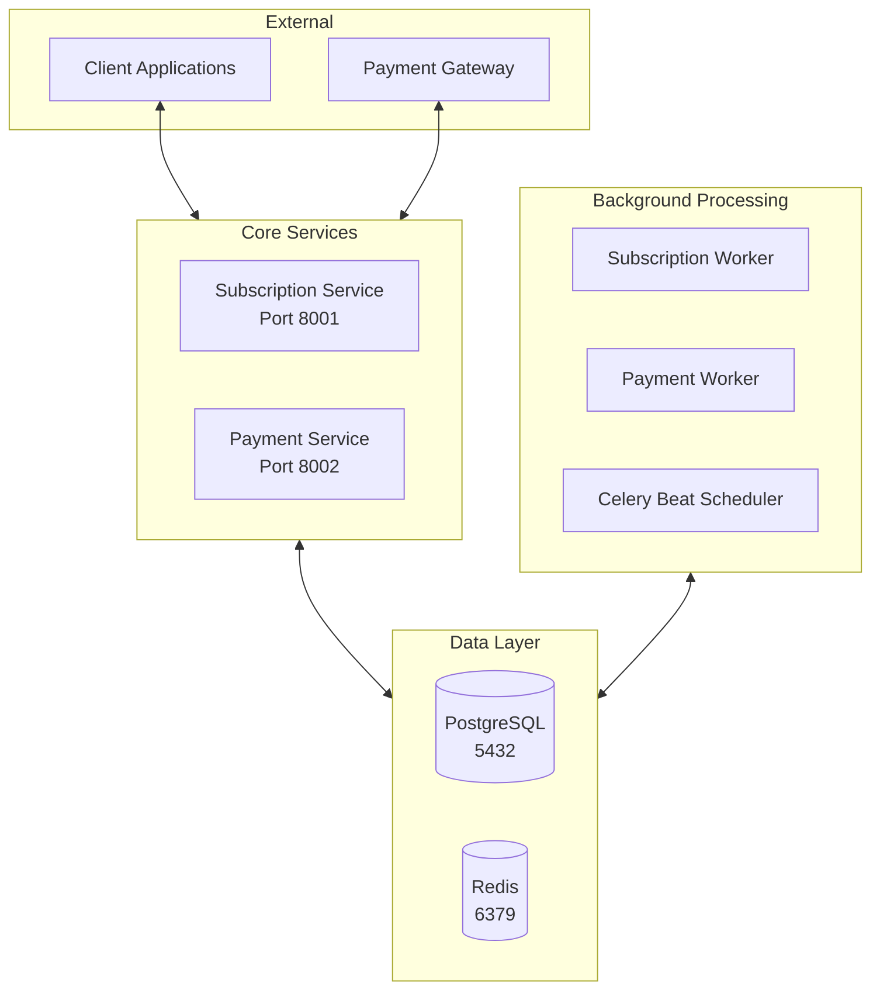
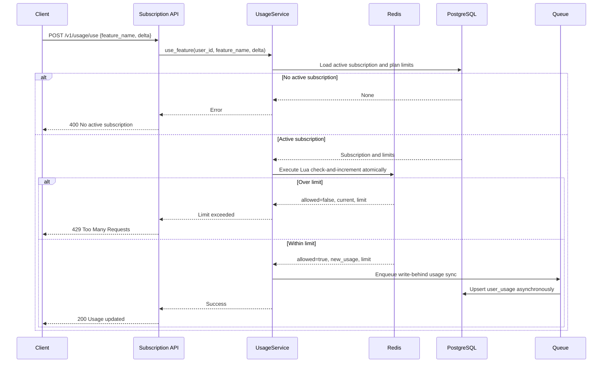
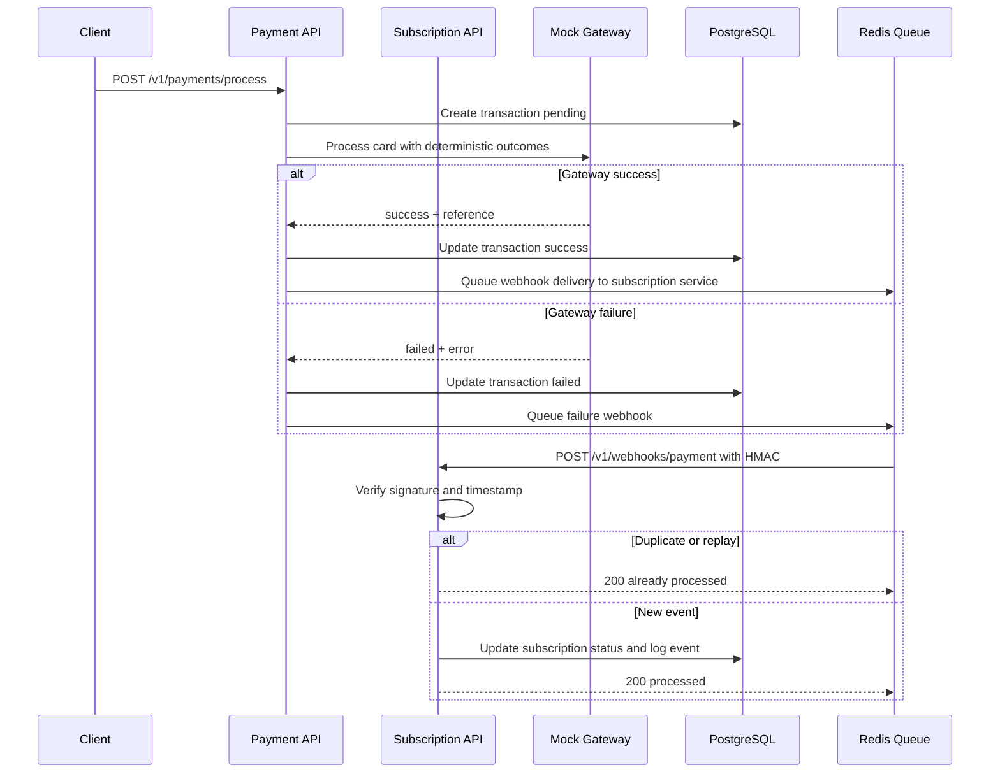
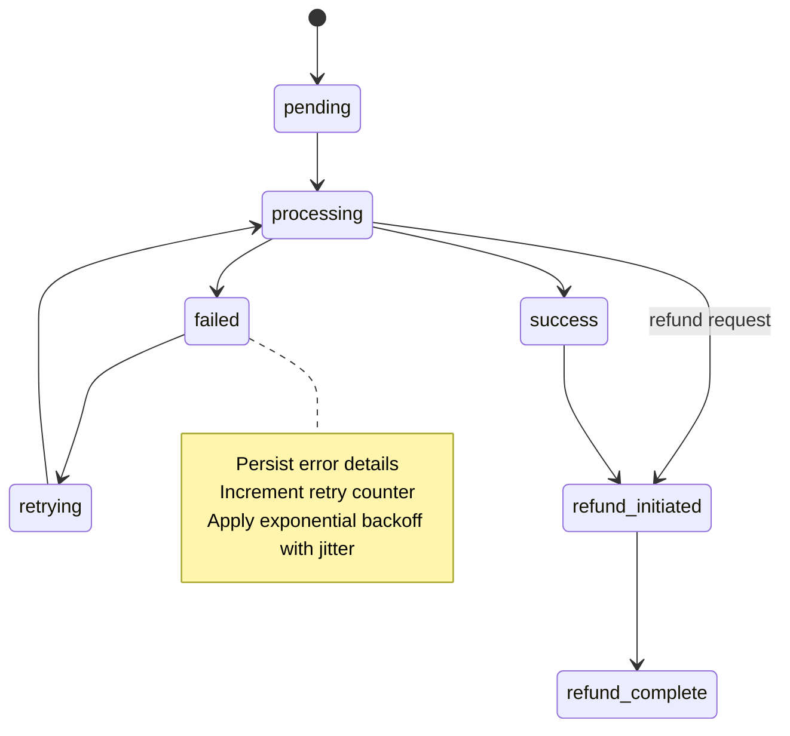
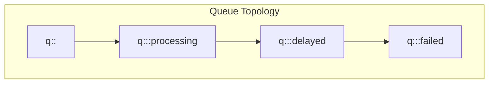
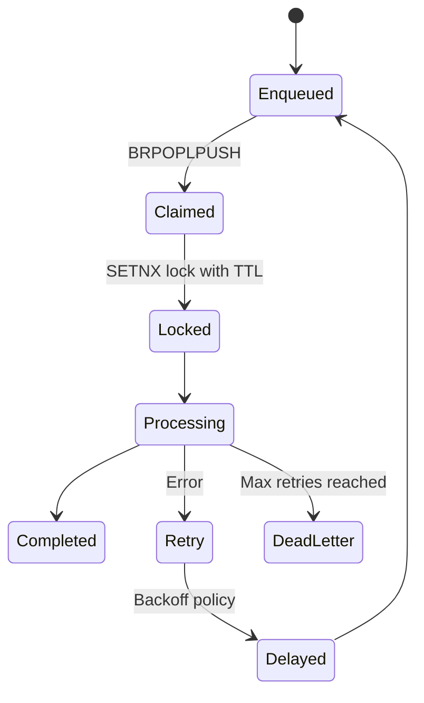

## Billing Backend System Technical Documentation

### Overview

This billing platform was engineered with care to be reliable, secure, and easy to operate. It provides subscription management, payment processing, usage tracking with atomic guarantees, and HMAC-secured webhooks. The services are built with FastAPI, PostgreSQL, Redis, and Celery, and the system follows 12‑Factor App principles for configuration, isolation, and observability.

The architecture emphasizes separation of concerns, explicit contracts at service boundaries, and predictable behavior under failure. Edge cases are handled thoughtfully with idempotency, duplicate detection, atomic operations, and robust retry strategies.

### Architecture at a Glance



### What sets this system apart

1. Atomic usage tracking that prevents race conditions using Redis Lua scripts and a write‑behind sync to PostgreSQL
2. HMAC‑secured webhooks with timestamp tolerance and constant‑time comparison to eliminate replay and timing attacks
3. Idempotent message processing with well‑defined envelopes, duplicate detection, and dead letter handling
4. Clear subscription lifecycle transitions and transactional safety around payment updates
5. A configuration system that enforces environment separation, validates secrets, and removes duplication
6. Consistent API response contracts and structured logging with correlation identifiers for traceability
7. Intentional failure design including exponential backoff, jitter, and bounded retries with monitoring hooks

### Service responsibilities

#### Subscription Service

1. Authentication and JWT token issuance
2. Trial and paid subscription lifecycle management
3. Feature usage accounting and limits
4. Inbound webhook processing from payment service
5. Health and queue monitoring endpoints

#### Payment Service

1. Card validation and transaction state management
2. Mock gateway integration with controlled outcomes
3. Webhook emission to subscription service with HMAC signatures
4. Refund initiation and lifecycle
5. Health and operational metrics

### Data model

```mermaid
erDiagram
  USERS ||--o{ SUBSCRIPTIONS : has
  PLANS ||--o{ SUBSCRIPTIONS : defines
  SUBSCRIPTIONS ||--o{ SUBSCRIPTION_EVENTS : logs
  SUBSCRIPTIONS ||--o{ TRANSACTIONS : pays_for
  TRANSACTIONS ||--|| GATEWAY_WEBHOOK_REQUESTS : receives
  TRANSACTIONS ||--o{ WEBHOOK_OUTBOUND_REQUESTS : emits
  USERS ||--o{ USER_USAGE : tracks

  USERS {
    int id PK
    varchar email UNIQUE
    varchar password_hash
    varchar first_name
    varchar last_name
    timestamptz created_at
    timestamptz updated_at
  }

  PLANS {
    int id PK
    varchar name
    decimal price
    varchar currency
    varchar billing_cycle
    jsonb features
    boolean is_active
    int trial_period_days
  }

  SUBSCRIPTIONS {
    uuid id PK
    int user_id FK
    int plan_id FK
    varchar status
    timestamptz start_date
    timestamptz end_date
    timestamptz canceled_at
  }

  TRANSACTIONS {
    uuid id PK
    uuid subscription_id FK
    decimal amount
    varchar currency
    varchar status
    varchar gateway_reference
    jsonb metadata
  }
```

### Request flows that matter

#### Usage tracking with atomic guarantees



#### Payment and webhook update



### Transaction state model



### Queueing model and reliability policies





### Configuration model

The configuration system provides a single source of truth with strict validation and environment separation. The loader reads a shared base file and overlays environment specific files. Production forbids development markers, requires strong secrets, and validates service URLs. Secrets are provided via environment variable substitution for non development environments.

1. Base configuration with environment overlays in `config/environments/*.env`
2. Centralized loading via `config/config_loader.py` with type validation
3. Strong secret length checks and production hardening rules
4. Environment manager script to validate, start, deploy, and monitor services

### Security properties

1. JWT authentication with HS256 and configurable expiration enforced by middleware in both services
2. Password storage with bcrypt and required complexity at the edges
3. Webhooks signed using HMAC SHA256 with timestamp tolerance to prevent replay
4. Signature verification performed using constant time comparison to eliminate timing attacks
5. Service to service endpoints protected with dedicated service secrets

### API design

The APIs are resource oriented, versioned with a v1 prefix, and return a consistent response envelope. Error responses are explicit and include structured details where appropriate. Swagger documentation is enabled for interactive exploration at each service root.

Response envelope example

```json
{
  "success": true,
  "data": {},
  "message": "Operation completed successfully",
  "timestamp": "2024-01-01T00:00:00Z"
}
```

### Edge cases and how they are handled

1. Duplicate webhooks are detected by unique identifiers and handled idempotently without side effects
2. Replay attacks are rejected using timestamp tolerance and constant time signature verification
3. Concurrent usage updates are guarded by atomic Redis Lua scripts, eliminating race conditions and double counting
4. Large deltas in usage requests are validated against remaining limits and rejected with clear feedback
5. Payment gateway flakiness is contained with exponential backoff, bounded retries, and dead letter routing
6. Partial failures are isolated by transactional updates and compensating events where necessary
7. Configuration drift is prevented by pre deployment validation and environment isolation

### Operations and observability

1. Health checks include database, Redis, and queue status with response times for quick triage
2. Structured JSON logging with correlation identifiers enables end to end traceability across services and workers
3. Queue depth, worker activity, and retry metrics are exposed for ongoing monitoring
4. Environment management via `scripts/env-manager.sh` provides start, deploy, logs, status, and validation commands across development, staging, and production

### Test strategy

1. Unit tests validate business logic, repository behavior, and security helpers
2. Integration tests cover endpoint contracts, database interactions, Redis operations, and webhooks
3. End to end flows validate the complete trial to paid journey including limits and upgrades
4. A dedicated testing environment reduces renewal periods and feature limits to enable fast validation of usage limits, renewal resets, and concurrent request safety

### Performance characteristics

1. Auth and usage pathways target sub 100 ms responses under normal load
2. Payment processing simulates real world latency while keeping the control plane responsive
3. Queue workers sustain high message throughput and apply backpressure through delayed and retry queues

### Getting started

1. Start development using the environment manager

```bash
./scripts/env-manager.sh -e development start
```

2. Open service documentation and health endpoints

```bash
open http://localhost:8001/docs
open http://localhost:8002/docs
curl http://localhost:8001/v1/health/detailed
```

3. Run tests or the accelerated testing suite

```bash
python scripts/run_tests.py --all
./scripts/test-runner.sh quick
```

### Closing notes

This system is designed to remain understandable at scale. Services have crisp responsibilities. Contracts are explicit and versioned. Failure paths are first class citizens with deterministic behavior. Configuration is centralized, validated, and environment aware. Security is built in rather than bolted on. The result is a billing platform that is pleasant to evolve, predictable to operate, and trustworthy under load. 