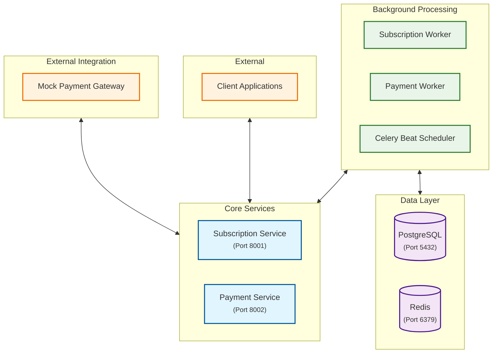
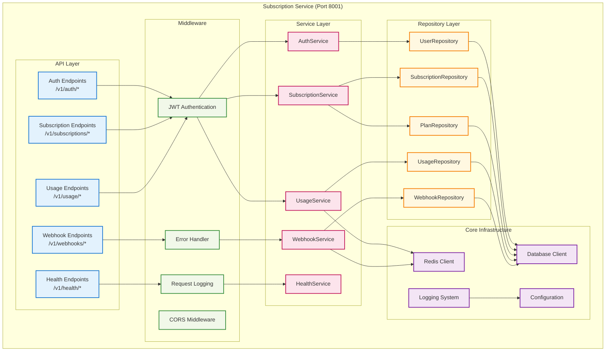
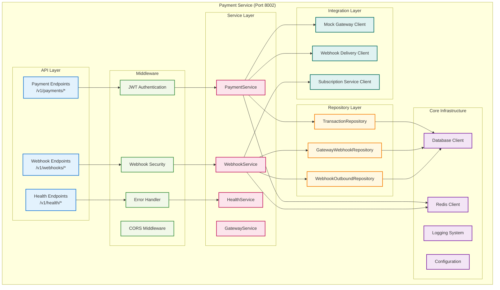
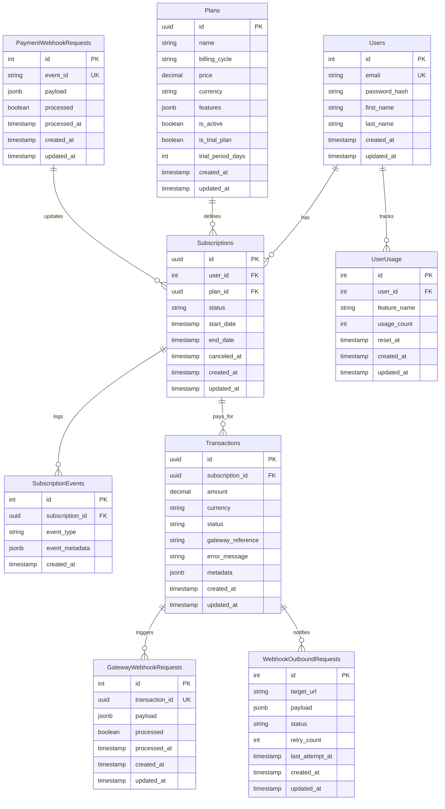
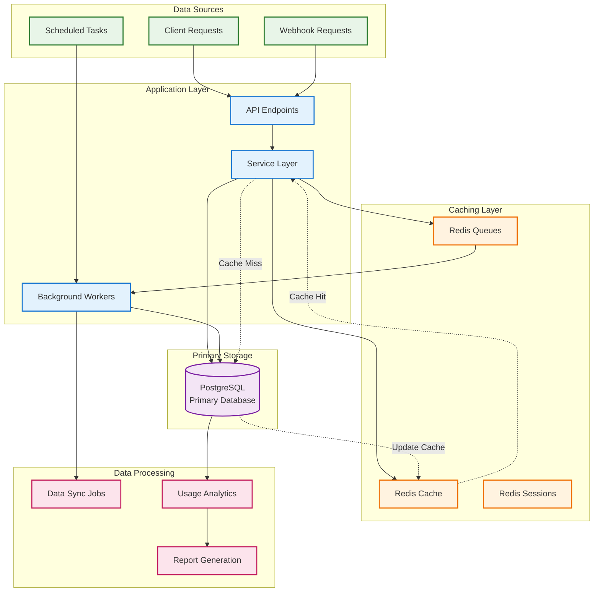
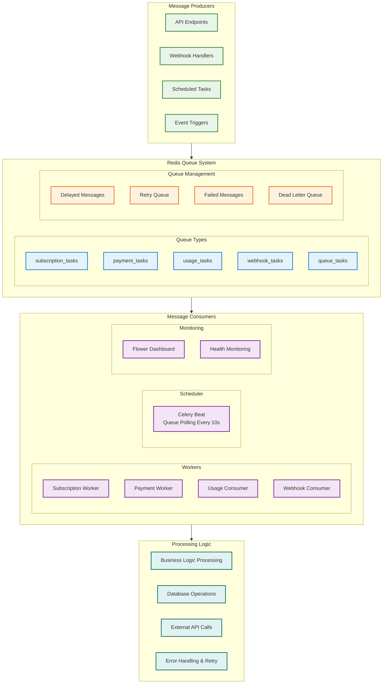
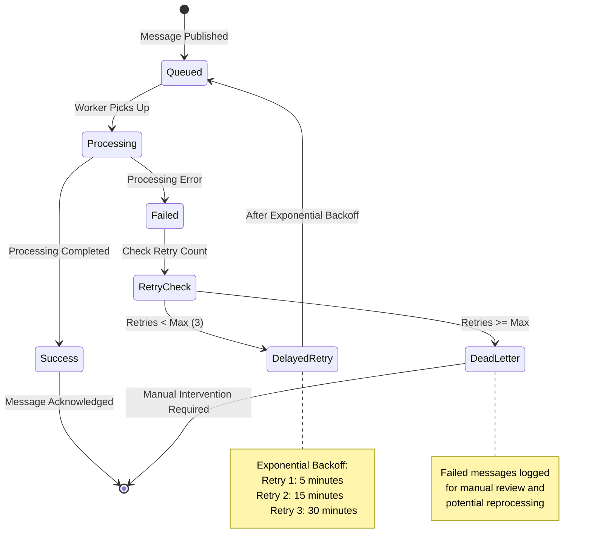
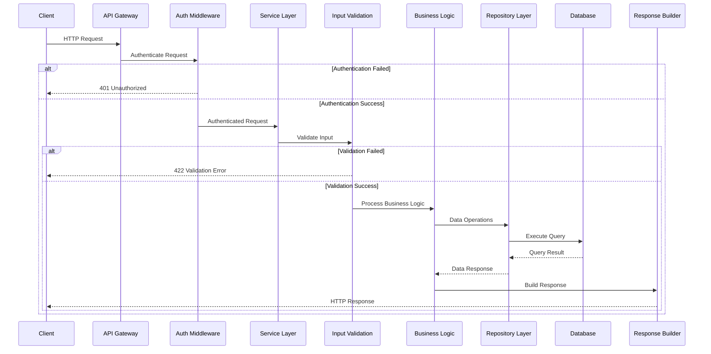

# Billing Backend System - Architecture Documentation

This document provides a comprehensive overview of the billing backend system architecture, including system components, data flow, deployment structure, and security models.

## Table of Contents

1. [System Overview](#system-overview)
2. [High-Level Architecture](#high-level-architecture)
3. [Service Architecture](#service-architecture)
4. [Data Architecture](#data-architecture)
5. [Infrastructure Architecture](#infrastructure-architecture)
6. [Security Architecture](#security-architecture)
7. [Queue & Message Architecture](#queue--message-architecture)
8. [API Architecture](#api-architecture)
9. [Deployment Architecture](#deployment-architecture)

---

## System Overview

The billing backend system is a **microservices-based architecture** designed for scalable subscription and payment management. It provides comprehensive billing capabilities including user authentication, subscription management, payment processing, usage tracking, and webhook integrations.

### Key Design Principles

- **Microservices Architecture**: Loosely coupled services with clear boundaries
- **Event-Driven Design**: Asynchronous processing using message queues
- **Security-First**: JWT authentication and HMAC-secured webhooks
- **Scalability**: Horizontal scaling with Redis caching and queue processing
- **Reliability**: Retry mechanisms, error handling, and transaction management
- **Observability**: Comprehensive logging and health monitoring

---

## High-Level Architecture

---

## Service Architecture

### Subscription Service Architecture

### Payment Service Architecture

---

## Data Architecture

### Database Schema Overview

### Data Flow Architecture

---

## Queue & Message Architecture

### Message Processing System

### Message Flow & Retry Logic

---

## API Architecture

### Request/Response Flow

---

## Summary

This billing backend system represents a **modern, scalable microservices architecture** with the following key characteristics:

### **Architectural Strengths:**
- **Microservices Design**: Clear service boundaries with domain-driven design
- **Event-Driven Architecture**: Asynchronous processing with reliable message queues
- **Security-First Approach**: Comprehensive authentication, authorization, and webhook security
- **Scalability**: Horizontal scaling capabilities with caching and queue distribution
- **Observability**: Comprehensive monitoring, logging, and health checking
- **Development-Friendly**: Docker-based development with hot reloading and easy setup

### **Technology Stack:**
- **Backend**: FastAPI (Python) with async/await support
- **Database**: PostgreSQL with async SQLAlchemy ORM
- **Caching/Queues**: Redis for both caching and message queuing
- **Task Processing**: Celery with Redis broker
- **Containerization**: Docker with docker-compose orchestration
- **API Documentation**: OpenAPI/Swagger with interactive documentation
- **Security**: JWT authentication, HMAC webhook signatures, bcrypt password hashing

### **Operational Excellence:**
- **Health Monitoring**: Comprehensive health checks across all system components
- **Error Handling**: Structured error handling with retry mechanisms and dead letter queues
- **Data Integrity**: Transaction management with rollback capabilities
- **Performance**: Redis caching for high-frequency operations
- **Reliability**: Idempotency handling and duplicate detection for critical operations

This architecture provides a solid foundation for a production-ready billing system that can handle enterprise-scale workloads while maintaining developer productivity and operational excellence. 