# Billing Backend System - Sequence Diagrams

This document contains comprehensive sequence diagrams for all important endpoints and functions in the billing backend system.

## Table of Contents

1. [Authentication Flows](#authentication-flows)
2. [Subscription Management](#subscription-management)
3. [Payment Processing](#payment-processing)
4. [Usage Tracking](#usage-tracking)
5. [Webhook Processing](#webhook-processing)
6. [Health & Monitoring](#health--monitoring)

---

## Authentication Flows

### 1. User Registration

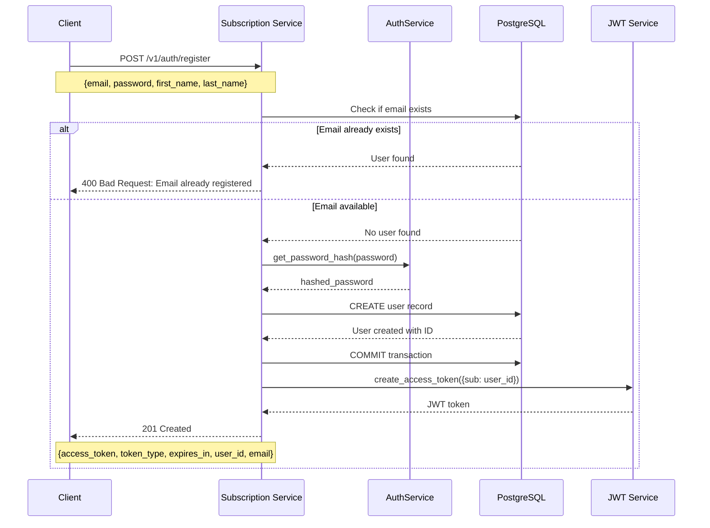
```mermaid
sequenceDiagram
    participant Client as Client
    participant API as Subscription Service
    participant Auth as AuthService
    participant DB as PostgreSQL
    participant JWT as JWT Service

    Client->>API: POST /v1/auth/register
    Note over Client,API: {email, password, first_name, last_name}
    
    API->>DB: Check if email exists
    alt Email already exists
        DB-->>API: User found
        API-->>Client: 400 Bad Request: Email already registered
    else Email available
        DB-->>API: No user found
        
        API->>Auth: get_password_hash(password)
        Auth-->>API: hashed_password
        
        API->>DB: CREATE user record
        DB-->>API: User created with ID
        
        API->>DB: COMMIT transaction
        
        API->>JWT: create_access_token({sub: user_id})
        JWT-->>API: JWT token
        
        API-->>Client: 201 Created
        Note over API,Client: {access_token, token_type, expires_in, user_id, email}
    end
```

### 2. User Login

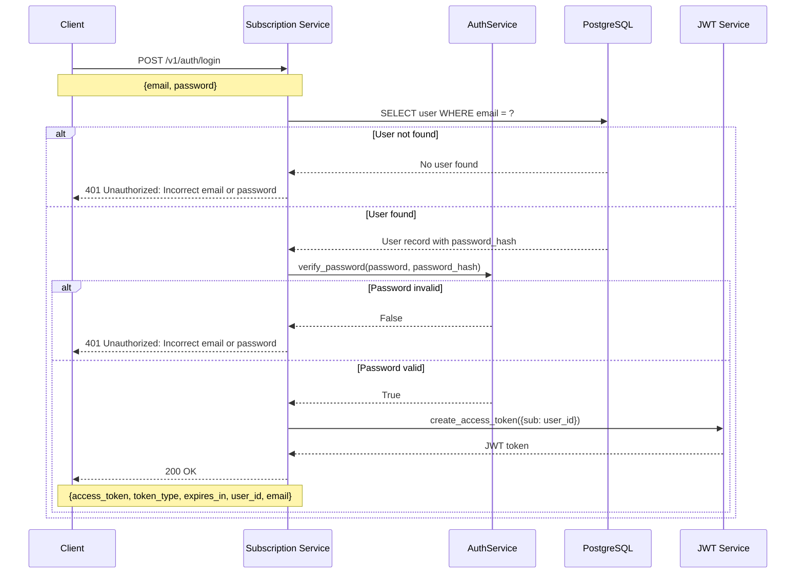
```mermaid
sequenceDiagram
    participant Client as Client
    participant API as Subscription Service
    participant Auth as AuthService
    participant DB as PostgreSQL
    participant JWT as JWT Service

    Client->>API: POST /v1/auth/login
    Note over Client,API: {email, password}
    
    API->>DB: SELECT user WHERE email = ?
    alt User not found
        DB-->>API: No user found
        API-->>Client: 401 Unauthorized: Incorrect email or password
    else User found
        DB-->>API: User record with password_hash
        
        API->>Auth: verify_password(password, password_hash)
        alt Password invalid
            Auth-->>API: False
            API-->>Client: 401 Unauthorized: Incorrect email or password
        else Password valid
            Auth-->>API: True
            
            API->>JWT: create_access_token({sub: user_id})
            JWT-->>API: JWT token
            
            API-->>Client: 200 OK
            Note over API,Client: {access_token, token_type, expires_in, user_id, email}
        end
    end
```

### 3. JWT Token Validation (Middleware)

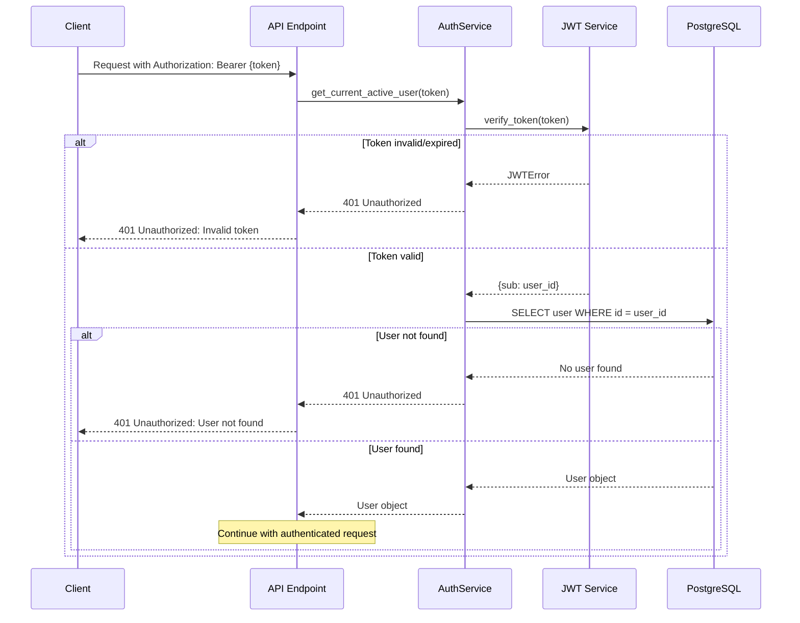
```mermaid
sequenceDiagram
    participant Client as Client
    participant API as API Endpoint
    participant Auth as AuthService
    participant JWT as JWT Service
    participant DB as PostgreSQL

    Client->>API: Request with Authorization: Bearer {token}
    
    API->>Auth: get_current_active_user(token)
    Auth->>JWT: verify_token(token)
    
    alt Token invalid/expired
        JWT-->>Auth: JWTError
        Auth-->>API: 401 Unauthorized
        API-->>Client: 401 Unauthorized: Invalid token
    else Token valid
        JWT-->>Auth: {sub: user_id}
        
        Auth->>DB: SELECT user WHERE id = user_id
        alt User not found
            DB-->>Auth: No user found
            Auth-->>API: 401 Unauthorized
            API-->>Client: 401 Unauthorized: User not found
        else User found
            DB-->>Auth: User object
            Auth-->>API: User object
            
            Note over API: Continue with authenticated request
        end
    end
```

---

## Subscription Management

### 4. Trial Subscription Creation

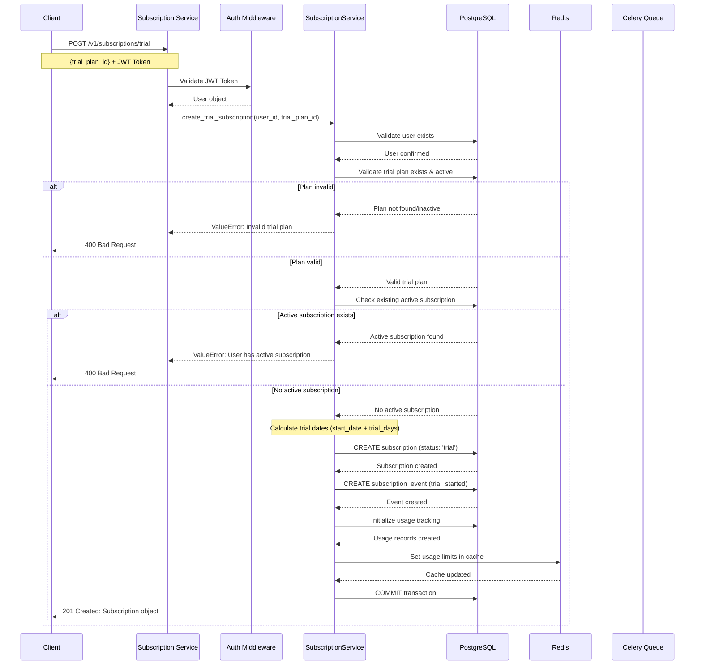
```mermaid
sequenceDiagram
    participant Client as Client
    participant SubAPI as Subscription Service
    participant Auth as Auth Middleware
    participant SubSvc as SubscriptionService
    participant DB as PostgreSQL
    participant Redis as Redis
    participant Queue as Celery Queue

    Client->>SubAPI: POST /v1/subscriptions/trial
    Note over Client,SubAPI: {trial_plan_id} + JWT Token
    
    SubAPI->>Auth: Validate JWT Token
    Auth-->>SubAPI: User object
    
    SubAPI->>SubSvc: create_trial_subscription(user_id, trial_plan_id)
    
    SubSvc->>DB: Validate user exists
    DB-->>SubSvc: User confirmed
    
    SubSvc->>DB: Validate trial plan exists & active
    alt Plan invalid
        DB-->>SubSvc: Plan not found/inactive
        SubSvc-->>SubAPI: ValueError: Invalid trial plan
        SubAPI-->>Client: 400 Bad Request
    else Plan valid
        DB-->>SubSvc: Valid trial plan
        
        SubSvc->>DB: Check existing active subscription
        alt Active subscription exists
            DB-->>SubSvc: Active subscription found
            SubSvc-->>SubAPI: ValueError: User has active subscription
            SubAPI-->>Client: 400 Bad Request
        else No active subscription
            DB-->>SubSvc: No active subscription
            
            Note over SubSvc: Calculate trial dates (start_date + trial_days)
            
            SubSvc->>DB: CREATE subscription (status: 'trial')
            DB-->>SubSvc: Subscription created
            
            SubSvc->>DB: CREATE subscription_event (trial_started)
            DB-->>SubSvc: Event created
            
            SubSvc->>DB: Initialize usage tracking
            DB-->>SubSvc: Usage records created
            
            SubSvc->>Redis: Set usage limits in cache
            Redis-->>SubSvc: Cache updated
            
            SubSvc->>DB: COMMIT transaction
            
            SubAPI-->>Client: 201 Created: Subscription object
        end
    end
```

### 5. Paid Subscription Creation

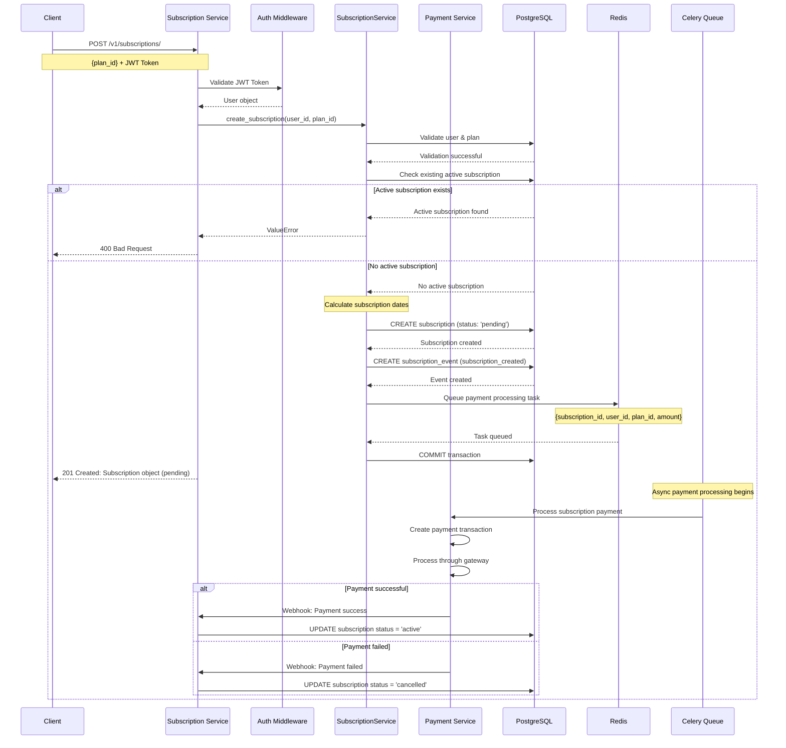
```mermaid
sequenceDiagram
    participant Client as Client
    participant SubAPI as Subscription Service
    participant Auth as Auth Middleware
    participant SubSvc as SubscriptionService
    participant PayAPI as Payment Service
    participant DB as PostgreSQL
    participant Redis as Redis
    participant Queue as Celery Queue

    Client->>SubAPI: POST /v1/subscriptions/
    Note over Client,SubAPI: {plan_id} + JWT Token
    
    SubAPI->>Auth: Validate JWT Token
    Auth-->>SubAPI: User object
    
    SubAPI->>SubSvc: create_subscription(user_id, plan_id)
    
    SubSvc->>DB: Validate user & plan
    DB-->>SubSvc: Validation successful
    
    SubSvc->>DB: Check existing active subscription
    alt Active subscription exists
        DB-->>SubSvc: Active subscription found
        SubSvc-->>SubAPI: ValueError
        SubAPI-->>Client: 400 Bad Request
    else No active subscription
        DB-->>SubSvc: No active subscription
        
        Note over SubSvc: Calculate subscription dates
        
        SubSvc->>DB: CREATE subscription (status: 'pending')
        DB-->>SubSvc: Subscription created
        
        SubSvc->>DB: CREATE subscription_event (subscription_created)
        DB-->>SubSvc: Event created
        
        SubSvc->>Redis: Queue payment processing task
        Note over Redis: {subscription_id, user_id, plan_id, amount}
        Redis-->>SubSvc: Task queued
        
        SubSvc->>DB: COMMIT transaction
        
        SubAPI-->>Client: 201 Created: Subscription object (pending)
        
        Note over Queue: Async payment processing begins
        Queue->>PayAPI: Process subscription payment
        PayAPI->>PayAPI: Create payment transaction
        PayAPI->>PayAPI: Process through gateway
        
        alt Payment successful
            PayAPI->>SubAPI: Webhook: Payment success
            SubAPI->>DB: UPDATE subscription status = 'active'
        else Payment failed
            PayAPI->>SubAPI: Webhook: Payment failed
            SubAPI->>DB: UPDATE subscription status = 'cancelled'
        end
    end
```

### 6. Subscription Status Check

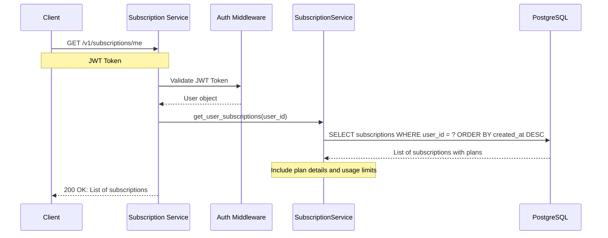
```mermaid
sequenceDiagram
    participant Client as Client
    participant SubAPI as Subscription Service
    participant Auth as Auth Middleware
    participant SubSvc as SubscriptionService
    participant DB as PostgreSQL

    Client->>SubAPI: GET /v1/subscriptions/me
    Note over Client,SubAPI: JWT Token
    
    SubAPI->>Auth: Validate JWT Token
    Auth-->>SubAPI: User object
    
    SubAPI->>SubSvc: get_user_subscriptions(user_id)
    
    SubSvc->>DB: SELECT subscriptions WHERE user_id = ? ORDER BY created_at DESC
    DB-->>SubSvc: List of subscriptions with plans
    
    Note over SubSvc: Include plan details and usage limits
    
    SubAPI-->>Client: 200 OK: List of subscriptions
```

---

## Payment Processing

### 7. Payment Processing Flow

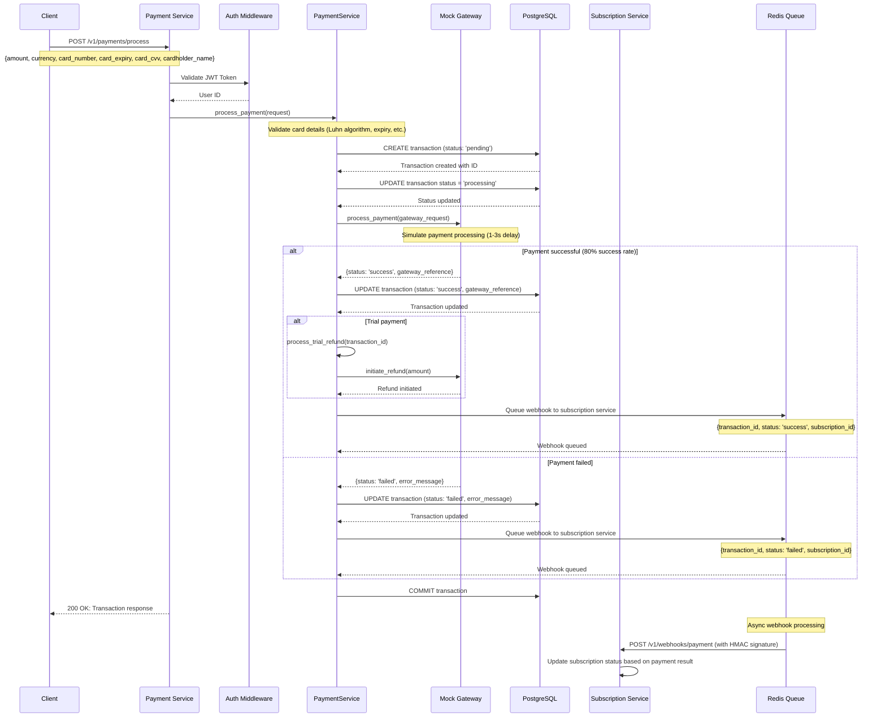
```mermaid
sequenceDiagram
    participant Client as Client
    participant PayAPI as Payment Service
    participant Auth as Auth Middleware
    participant PaySvc as PaymentService
    participant Gateway as Mock Gateway
    participant DB as PostgreSQL
    participant SubAPI as Subscription Service
    participant Redis as Redis Queue

    Client->>PayAPI: POST /v1/payments/process
    Note over Client,PayAPI: {amount, currency, card_number, card_expiry, card_cvv, cardholder_name}
    
    PayAPI->>Auth: Validate JWT Token
    Auth-->>PayAPI: User ID
    
    PayAPI->>PaySvc: process_payment(request)
    
    Note over PaySvc: Validate card details (Luhn algorithm, expiry, etc.)
    
    PaySvc->>DB: CREATE transaction (status: 'pending')
    DB-->>PaySvc: Transaction created with ID
    
    PaySvc->>DB: UPDATE transaction status = 'processing'
    DB-->>PaySvc: Status updated
    
    PaySvc->>Gateway: process_payment(gateway_request)
    Note over Gateway: Simulate payment processing (1-3s delay)
    
    alt Payment successful (80% success rate)
        Gateway-->>PaySvc: {status: 'success', gateway_reference}
        
        PaySvc->>DB: UPDATE transaction (status: 'success', gateway_reference)
        DB-->>PaySvc: Transaction updated
        
        alt Trial payment
            PaySvc->>PaySvc: process_trial_refund(transaction_id)
            PaySvc->>Gateway: initiate_refund(amount)
            Gateway-->>PaySvc: Refund initiated
        end
        
        PaySvc->>Redis: Queue webhook to subscription service
        Note over Redis: {transaction_id, status: 'success', subscription_id}
        Redis-->>PaySvc: Webhook queued
        
    else Payment failed
        Gateway-->>PaySvc: {status: 'failed', error_message}
        
        PaySvc->>DB: UPDATE transaction (status: 'failed', error_message)
        DB-->>PaySvc: Transaction updated
        
        PaySvc->>Redis: Queue webhook to subscription service
        Note over Redis: {transaction_id, status: 'failed', subscription_id}
        Redis-->>PaySvc: Webhook queued
    end
    
    PaySvc->>DB: COMMIT transaction
    
    PayAPI-->>Client: 200 OK: Transaction response
    
    Note over Redis: Async webhook processing
    Redis->>SubAPI: POST /v1/webhooks/payment (with HMAC signature)
    SubAPI->>SubAPI: Update subscription status based on payment result
```

### 8. Payment Refund Flow

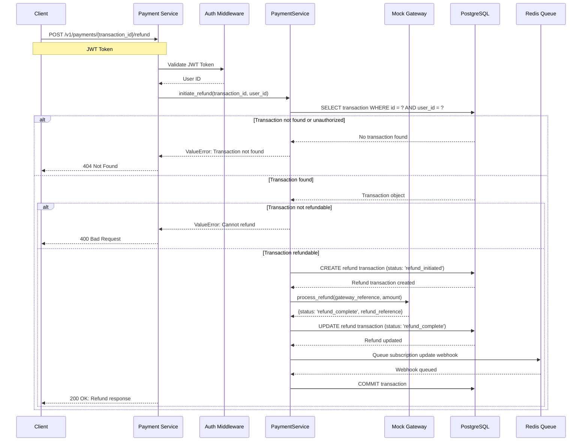
```mermaid
sequenceDiagram
    participant Client as Client
    participant PayAPI as Payment Service
    participant Auth as Auth Middleware
    participant PaySvc as PaymentService
    participant Gateway as Mock Gateway
    participant DB as PostgreSQL
    participant Redis as Redis Queue

    Client->>PayAPI: POST /v1/payments/{transaction_id}/refund
    Note over Client,PayAPI: JWT Token
    
    PayAPI->>Auth: Validate JWT Token
    Auth-->>PayAPI: User ID
    
    PayAPI->>PaySvc: initiate_refund(transaction_id, user_id)
    
    PaySvc->>DB: SELECT transaction WHERE id = ? AND user_id = ?
    alt Transaction not found or unauthorized
        DB-->>PaySvc: No transaction found
        PaySvc-->>PayAPI: ValueError: Transaction not found
        PayAPI-->>Client: 404 Not Found
    else Transaction found
        DB-->>PaySvc: Transaction object
        
        alt Transaction not refundable
            PaySvc-->>PayAPI: ValueError: Cannot refund
            PayAPI-->>Client: 400 Bad Request
        else Transaction refundable
            PaySvc->>DB: CREATE refund transaction (status: 'refund_initiated')
            DB-->>PaySvc: Refund transaction created
            
            PaySvc->>Gateway: process_refund(gateway_reference, amount)
            Gateway-->>PaySvc: {status: 'refund_complete', refund_reference}
            
            PaySvc->>DB: UPDATE refund transaction (status: 'refund_complete')
            DB-->>PaySvc: Refund updated
            
            PaySvc->>Redis: Queue subscription update webhook
            Redis-->>PaySvc: Webhook queued
            
            PaySvc->>DB: COMMIT transaction
            
            PayAPI-->>Client: 200 OK: Refund response
        end
    end
```

---

## Usage Tracking

### 9. Feature Usage Tracking

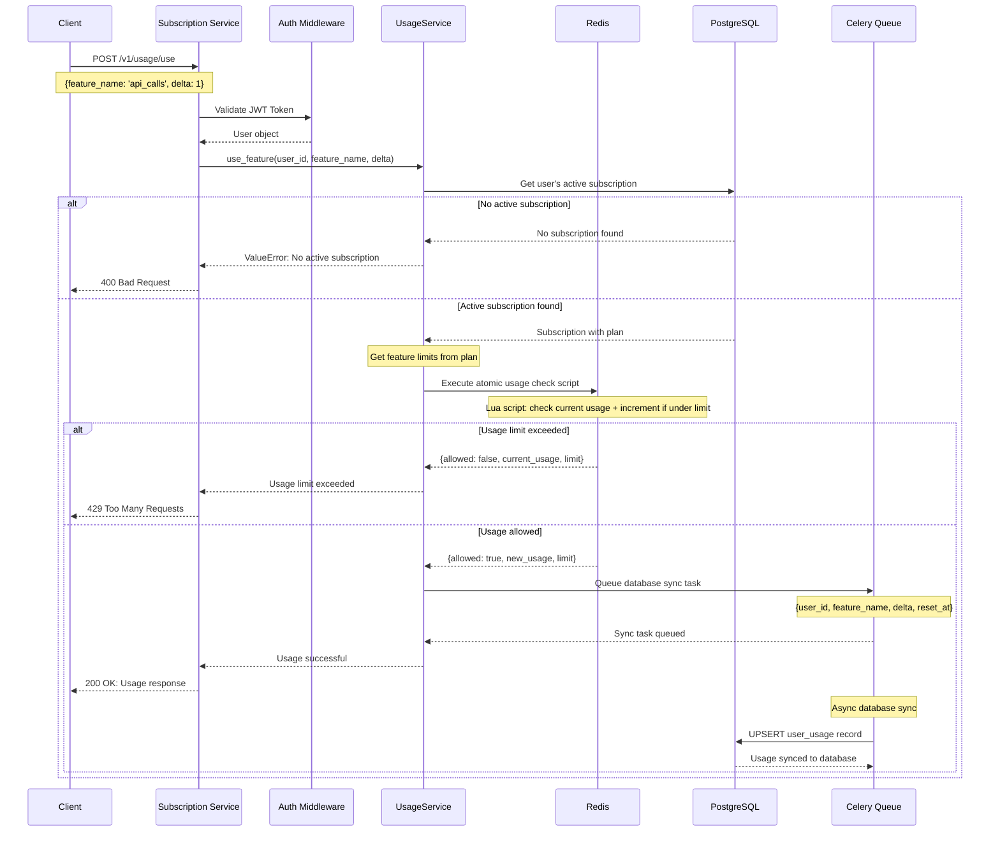
```mermaid
sequenceDiagram
    participant Client as Client
    participant SubAPI as Subscription Service
    participant Auth as Auth Middleware
    participant UsageSvc as UsageService
    participant Redis as Redis
    participant DB as PostgreSQL
    participant Queue as Celery Queue

    Client->>SubAPI: POST /v1/usage/use
    Note over Client,SubAPI: {feature_name: 'api_calls', delta: 1}
    
    SubAPI->>Auth: Validate JWT Token
    Auth-->>SubAPI: User object
    
    SubAPI->>UsageSvc: use_feature(user_id, feature_name, delta)
    
    UsageSvc->>DB: Get user's active subscription
    alt No active subscription
        DB-->>UsageSvc: No subscription found
        UsageSvc-->>SubAPI: ValueError: No active subscription
        SubAPI-->>Client: 400 Bad Request
    else Active subscription found
        DB-->>UsageSvc: Subscription with plan
        
        Note over UsageSvc: Get feature limits from plan
        
        UsageSvc->>Redis: Execute atomic usage check script
        Note over Redis: Lua script: check current usage + increment if under limit
        
        alt Usage limit exceeded
            Redis-->>UsageSvc: {allowed: false, current_usage, limit}
            UsageSvc-->>SubAPI: Usage limit exceeded
            SubAPI-->>Client: 429 Too Many Requests
        else Usage allowed
            Redis-->>UsageSvc: {allowed: true, new_usage, limit}
            
            UsageSvc->>Queue: Queue database sync task
            Note over Queue: {user_id, feature_name, delta, reset_at}
            Queue-->>UsageSvc: Sync task queued
            
            UsageSvc-->>SubAPI: Usage successful
            SubAPI-->>Client: 200 OK: Usage response
            
            Note over Queue: Async database sync
            Queue->>DB: UPSERT user_usage record
            DB-->>Queue: Usage synced to database
        end
    end
```

### 10. Usage Statistics Retrieval

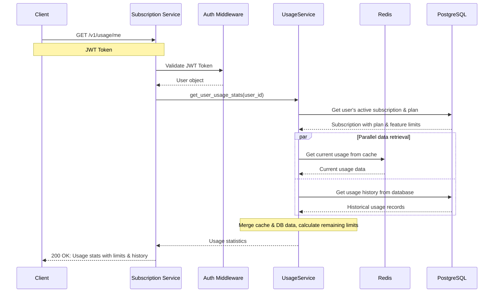
```mermaid
sequenceDiagram
    participant Client as Client
    participant SubAPI as Subscription Service
    participant Auth as Auth Middleware
    participant UsageSvc as UsageService
    participant Redis as Redis
    participant DB as PostgreSQL

    Client->>SubAPI: GET /v1/usage/me
    Note over Client,SubAPI: JWT Token
    
    SubAPI->>Auth: Validate JWT Token
    Auth-->>SubAPI: User object
    
    SubAPI->>UsageSvc: get_user_usage_stats(user_id)
    
    UsageSvc->>DB: Get user's active subscription & plan
    DB-->>UsageSvc: Subscription with plan & feature limits
    
    par Parallel data retrieval
        UsageSvc->>Redis: Get current usage from cache
        Redis-->>UsageSvc: Current usage data
    and
        UsageSvc->>DB: Get usage history from database
        DB-->>UsageSvc: Historical usage records
    end
    
    Note over UsageSvc: Merge cache & DB data, calculate remaining limits
    
    UsageSvc-->>SubAPI: Usage statistics
    SubAPI-->>Client: 200 OK: Usage stats with limits & history
```

---

## Webhook Processing

### 11. Payment Webhook Processing (Subscription Service)

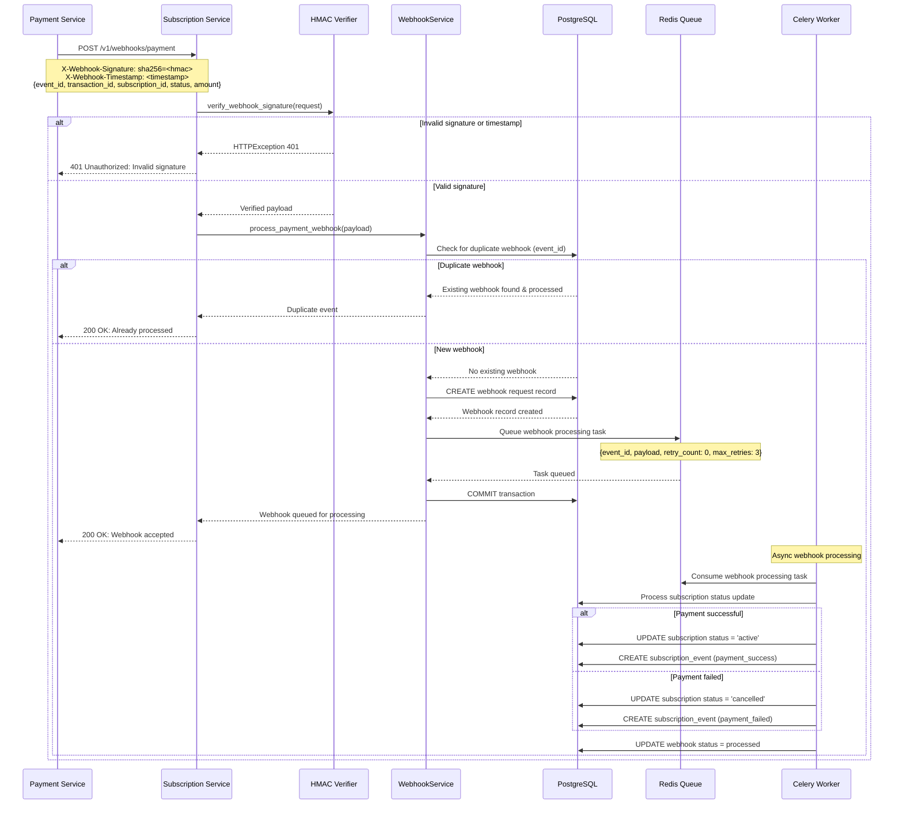
```mermaid
sequenceDiagram
    participant PaySvc as Payment Service
    participant SubAPI as Subscription Service
    participant WebhookAuth as HMAC Verifier
    participant WebhookSvc as WebhookService
    participant DB as PostgreSQL
    participant Redis as Redis Queue
    participant Worker as Celery Worker

    PaySvc->>SubAPI: POST /v1/webhooks/payment
    Note over PaySvc,SubAPI: X-Webhook-Signature: sha256=<hmac><br/>X-Webhook-Timestamp: <timestamp><br/>{event_id, transaction_id, subscription_id, status, amount}
    
    SubAPI->>WebhookAuth: verify_webhook_signature(request)
    
    alt Invalid signature or timestamp
        WebhookAuth-->>SubAPI: HTTPException 401
        SubAPI-->>PaySvc: 401 Unauthorized: Invalid signature
    else Valid signature
        WebhookAuth-->>SubAPI: Verified payload
        
        SubAPI->>WebhookSvc: process_payment_webhook(payload)
        
        WebhookSvc->>DB: Check for duplicate webhook (event_id)
        alt Duplicate webhook
            DB-->>WebhookSvc: Existing webhook found & processed
            WebhookSvc-->>SubAPI: Duplicate event
            SubAPI-->>PaySvc: 200 OK: Already processed
        else New webhook
            DB-->>WebhookSvc: No existing webhook
            
            WebhookSvc->>DB: CREATE webhook request record
            DB-->>WebhookSvc: Webhook record created
            
            WebhookSvc->>Redis: Queue webhook processing task
            Note over Redis: {event_id, payload, retry_count: 0, max_retries: 3}
            Redis-->>WebhookSvc: Task queued
            
            WebhookSvc->>DB: COMMIT transaction
            
            WebhookSvc-->>SubAPI: Webhook queued for processing
            SubAPI-->>PaySvc: 200 OK: Webhook accepted
            
            Note over Worker: Async webhook processing
            Worker->>Redis: Consume webhook processing task
            Worker->>DB: Process subscription status update
            
            alt Payment successful
                Worker->>DB: UPDATE subscription status = 'active'
                Worker->>DB: CREATE subscription_event (payment_success)
            else Payment failed
                Worker->>DB: UPDATE subscription status = 'cancelled'
                Worker->>DB: CREATE subscription_event (payment_failed)
            end
            
            Worker->>DB: UPDATE webhook status = processed
        end
    end
```

### 12. Gateway Webhook Processing (Payment Service)

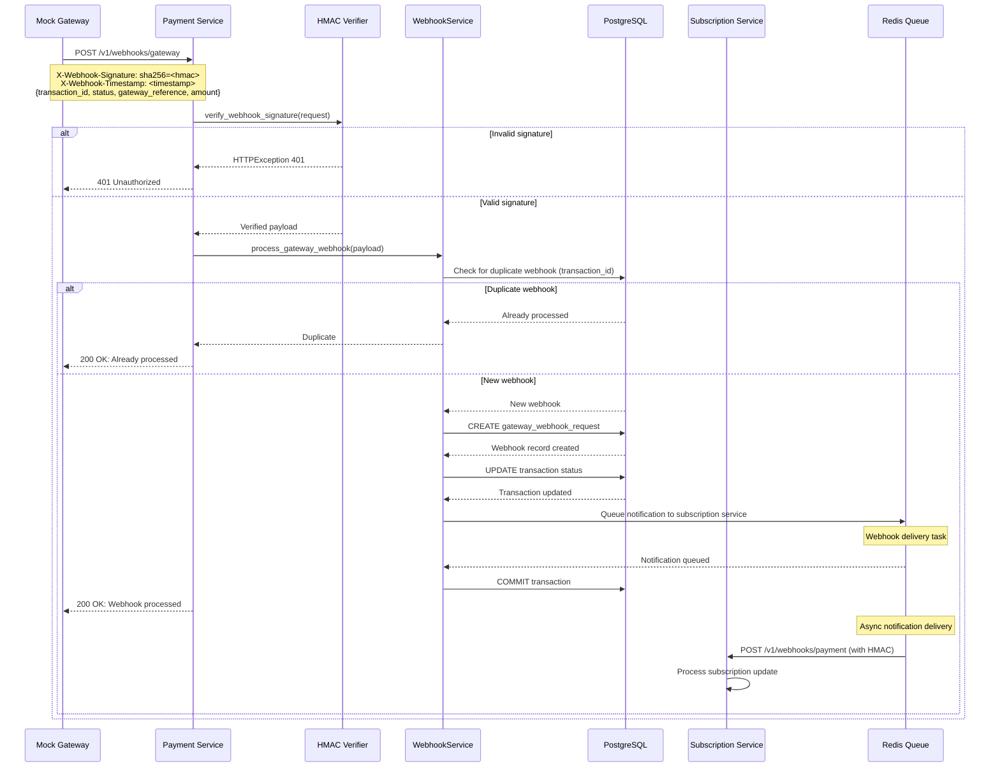
```mermaid
sequenceDiagram
    participant Gateway as Mock Gateway
    participant PayAPI as Payment Service
    participant WebhookAuth as HMAC Verifier
    participant WebhookSvc as WebhookService
    participant DB as PostgreSQL
    participant SubAPI as Subscription Service
    participant Redis as Redis Queue

    Gateway->>PayAPI: POST /v1/webhooks/gateway
    Note over Gateway,PayAPI: X-Webhook-Signature: sha256=<hmac><br/>X-Webhook-Timestamp: <timestamp><br/>{transaction_id, status, gateway_reference, amount}
    
    PayAPI->>WebhookAuth: verify_webhook_signature(request)
    
    alt Invalid signature
        WebhookAuth-->>PayAPI: HTTPException 401
        PayAPI-->>Gateway: 401 Unauthorized
    else Valid signature
        WebhookAuth-->>PayAPI: Verified payload
        
        PayAPI->>WebhookSvc: process_gateway_webhook(payload)
        
        WebhookSvc->>DB: Check for duplicate webhook (transaction_id)
        alt Duplicate webhook
            DB-->>WebhookSvc: Already processed
            WebhookSvc-->>PayAPI: Duplicate
            PayAPI-->>Gateway: 200 OK: Already processed
        else New webhook
            DB-->>WebhookSvc: New webhook
            
            WebhookSvc->>DB: CREATE gateway_webhook_request
            DB-->>WebhookSvc: Webhook record created
            
            WebhookSvc->>DB: UPDATE transaction status
            DB-->>WebhookSvc: Transaction updated
            
            WebhookSvc->>Redis: Queue notification to subscription service
            Note over Redis: Webhook delivery task
            Redis-->>WebhookSvc: Notification queued
            
            WebhookSvc->>DB: COMMIT transaction
            
            PayAPI-->>Gateway: 200 OK: Webhook processed
            
            Note over Redis: Async notification delivery
            Redis->>SubAPI: POST /v1/webhooks/payment (with HMAC)
            SubAPI->>SubAPI: Process subscription update
        end
    end
```

---

## Health & Monitoring

### 13. Health Check Flow

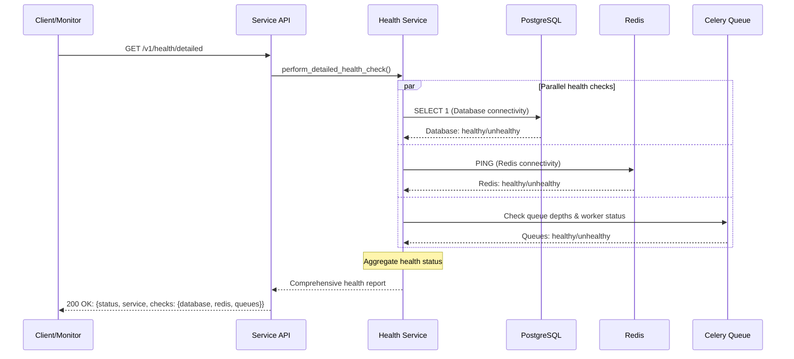
```mermaid
sequenceDiagram
    participant Client as Client/Monitor
    participant API as Service API
    participant HealthSvc as Health Service
    participant DB as PostgreSQL
    participant Redis as Redis
    participant Queue as Celery Queue

    Client->>API: GET /v1/health/detailed
    
    API->>HealthSvc: perform_detailed_health_check()
    
    par Parallel health checks
        HealthSvc->>DB: SELECT 1 (Database connectivity)
        DB-->>HealthSvc: Database: healthy/unhealthy
    and
        HealthSvc->>Redis: PING (Redis connectivity)
        Redis-->>HealthSvc: Redis: healthy/unhealthy
    and
        HealthSvc->>Queue: Check queue depths & worker status
        Queue-->>HealthSvc: Queues: healthy/unhealthy
    end
    
    Note over HealthSvc: Aggregate health status
    
    HealthSvc-->>API: Comprehensive health report
    API-->>Client: 200 OK: {status, service, checks: {database, redis, queues}}
```

### 14. Queue Processing Flow

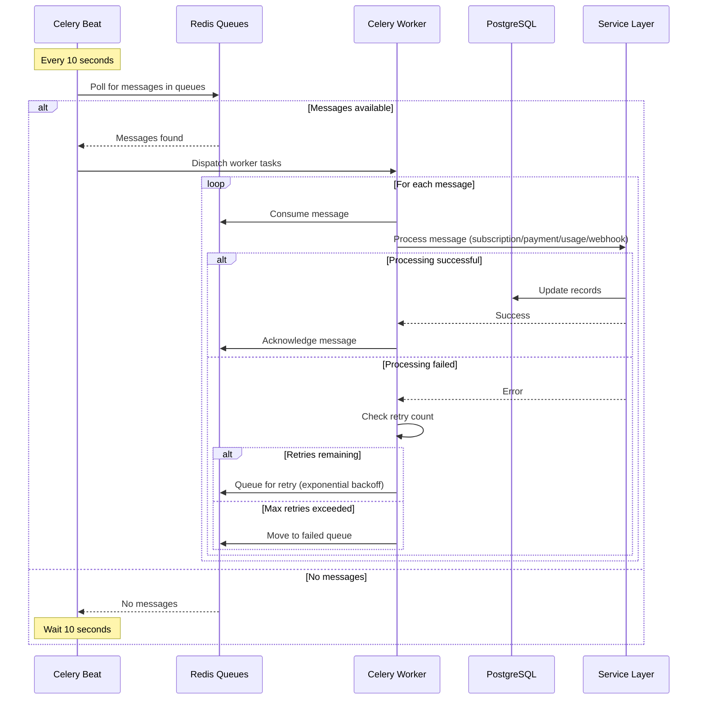
```mermaid
sequenceDiagram
    participant Beat as Celery Beat
    participant Redis as Redis Queues
    participant Worker as Celery Worker
    participant DB as PostgreSQL
    participant Service as Service Layer

    Note over Beat: Every 10 seconds
    Beat->>Redis: Poll for messages in queues
    
    alt Messages available
        Redis-->>Beat: Messages found
        Beat->>Worker: Dispatch worker tasks
        
        loop For each message
            Worker->>Redis: Consume message
            Worker->>Service: Process message (subscription/payment/usage/webhook)
            
            alt Processing successful
                Service->>DB: Update records
                Service-->>Worker: Success
                Worker->>Redis: Acknowledge message
            else Processing failed
                Service-->>Worker: Error
                Worker->>Worker: Check retry count
                
                alt Retries remaining
                    Worker->>Redis: Queue for retry (exponential backoff)
                else Max retries exceeded
                    Worker->>Redis: Move to failed queue
                end
            end
        end
    else No messages
        Redis-->>Beat: No messages
        Note over Beat: Wait 10 seconds
    end
```

---

## Error Handling Patterns

### 15. Global Error Handling Flow

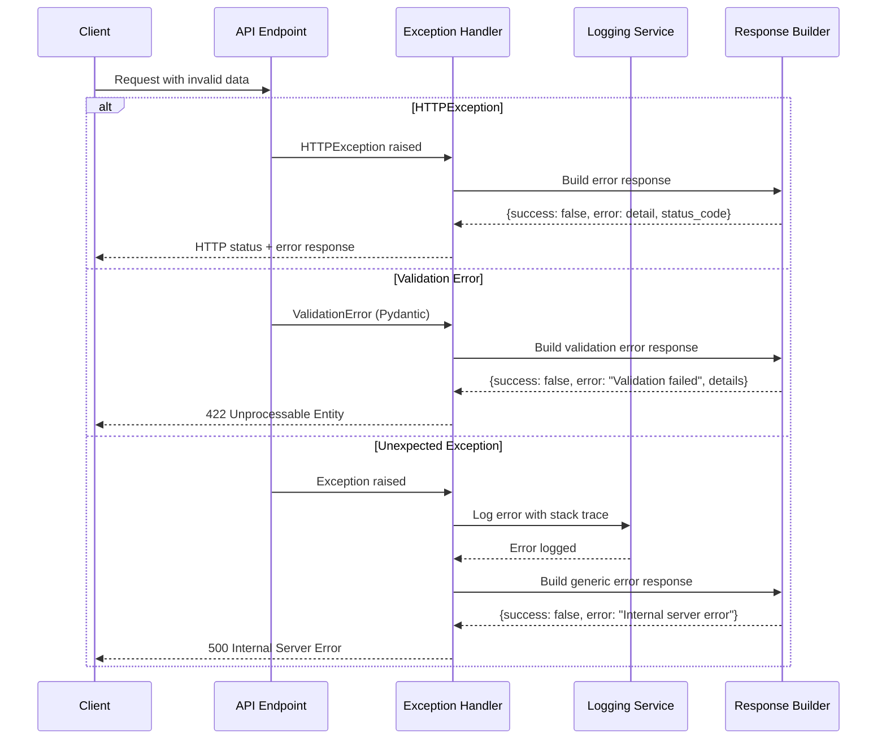
```mermaid
sequenceDiagram
    participant Client as Client
    participant API as API Endpoint
    participant Handler as Exception Handler
    participant Logger as Logging Service
    participant Response as Response Builder

    Client->>API: Request with invalid data
    
    alt HTTPException
        API->>Handler: HTTPException raised
        Handler->>Response: Build error response
        Response-->>Handler: {success: false, error: detail, status_code}
        Handler-->>Client: HTTP status + error response
    else Validation Error
        API->>Handler: ValidationError (Pydantic)
        Handler->>Response: Build validation error response
        Response-->>Handler: {success: false, error: "Validation failed", details}
        Handler-->>Client: 422 Unprocessable Entity
    else Unexpected Exception
        API->>Handler: Exception raised
        Handler->>Logger: Log error with stack trace
        Logger-->>Handler: Error logged
        Handler->>Response: Build generic error response
        Response-->>Handler: {success: false, error: "Internal server error"}
        Handler-->>Client: 500 Internal Server Error
    end
```

These sequence diagrams provide a comprehensive view of all the important flows in your billing backend system, including success paths, error scenarios, and async processing patterns. Each diagram shows the complete interaction between services, databases, and external systems. 